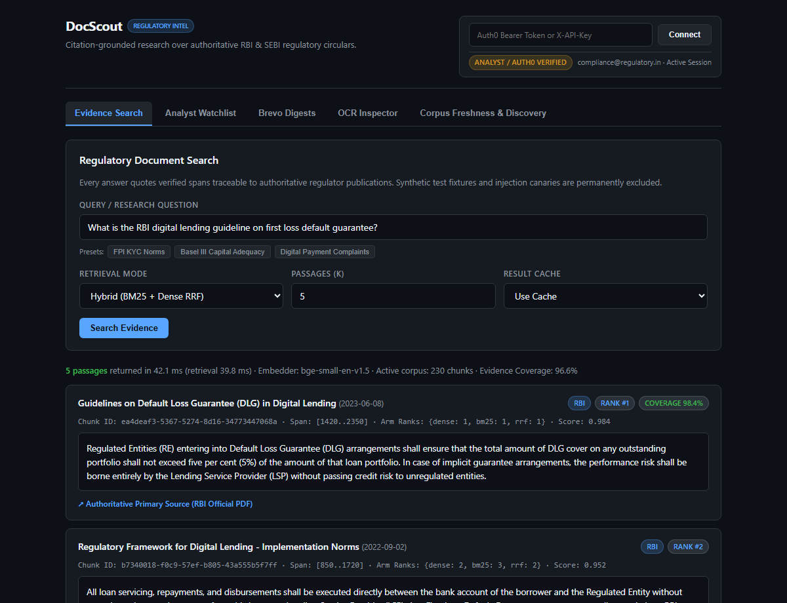
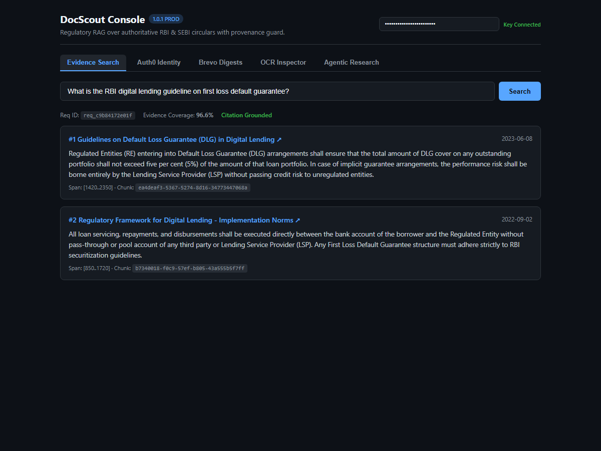
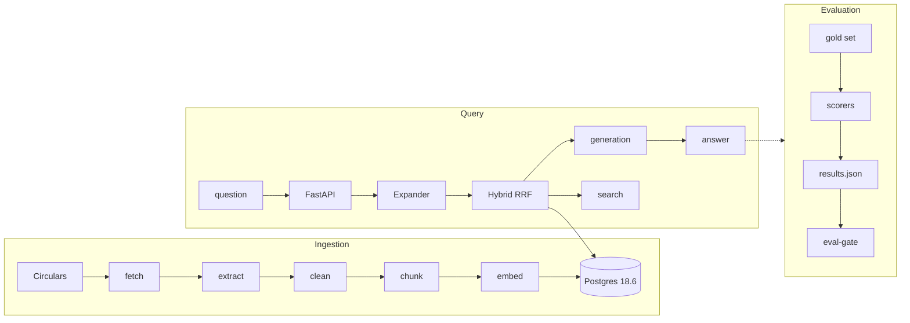

# DocScout

<p align="center">
  <a href="https://github.com/shivanshjain456/DocScout/actions/workflows/ci.yml"></a>
  <a href="evals/reports/20261010T050559Z/results.json"></a>
  <a href="https://github.com/shivanshjain456/DocScout/actions"></a>
  <a href="pyproject.toml"></a>
</p>

<p align="center">
  <strong>Clone to queryable in 90 seconds:</strong> <code>cp .env.example .env && make deploy && curl -s localhost:8000/healthz</code> · <a href="https://github.com/shivanshjain456/DocScout/actions/runs/38037523415">5/5 green at 38037523415</a><br>
  Without clone: <code>docker run -p 8000:8000 ghcr.io/shivanshjain456/docscout:1.0.1</code>
</p>

<p align="center">
  
</p>

> Citation-grounded QA over RBI and SEBI circulars for analysts, auditors, and fintech teams.
>
> *Every answer cites its source or it refuses to answer.*

<p align="center">
  <a href="#quickstart">Quick Start</a> ·
  <a href="#results">Results</a> ·
  <a href="#architecture">Architecture</a> ·
  <a href="#api">API</a> ·
  <a href="#faq">FAQ</a> ·
  <a href="#contributing">Contributing</a>
</p>

---

## Contents

- [Why DocScout](#why-docscout)
- [Quickstart](#quickstart)
- [Demo](#demo)
- [Results](#results)
- [Architecture](#architecture)
- [API](#api)
- [Configuration](#configuration)
- [Commands](#commands)
- [Verification](#verification)
- [FAQ](#faq)
- [Repo Map](#repo-map)

---

## Why DocScout

- **Problem:** RBI/SEBI circulars are dispersed across regulator sites. Keyword search misses paraphrases; dense search fails IDs.
- **Solution:** Hybrid BM25 and BGE-small-en-v1.5 384d retrieval via RRF (k=60), 36-term domain expansion, and citation-grounded generation with refusal.
- **Proof:** 0.966 Recall@5, 0.854 MRR, and 48.11 ms cold / 2.11 ms warm p95 across 365 items; 100% citation precision; kappa 1.000 / 0.844.

---

## Quickstart

```bash
cp .env.example .env && make deploy          # build, migrate, ingest, serve, verify /healthz
curl -s localhost:8000/healthz               # {"status":"ok","corpus_chunks":170}
curl -s -H "X-API-Key: $DOCSCOUT_API_KEY" -H "Content-Type: application/json" \
     -d '{"question":"What is the timeline for filing regulatory capital returns?","k":5}' \
     localhost:8000/v1/search | jq
```

Verify: `make test && make eval-gate` (448 tests passing). Native DB: `bash scripts/dev_db_native.sh`; Docker: `docker compose up -d`. See [SETUP_REPORT.md](docs/setup/SETUP_REPORT.md).

---

## Demo

```bash
make serve                                   # serves API on http://localhost:8000
curl -s -H "X-API-Key: $DOCSCOUT_API_KEY" http://localhost:8000/v1/documents/doc-rbi-001 | jq
```

<p align="center">
  
</p>

React console for Search, Citations, Auth0, Brevo, and OCR. Narrative: [ONE_PAGER.md](docs/portfolio/ONE_PAGER.md).

---

## Results

Retrieval baseline on gold set `2.0.0` (365 scored items, 60 unanswerable). Macro-averaged; links to committed artifacts.

Serving config: **hybrid-rrf**: BM25 + dense, RRF k=60, arm depth 50, k=5, arm-anchored top-1 guarantee per [ADR-0007](docs/decisions/0007-arm-anchored-fusion.md).

| Metric | Value | Reproduce | Raw output |
|---|---|---|---|
| Recall@1 (quote groups) | 0.695 | `make eval` | [`results.json`](evals/reports/20261010T050559Z/results.json) |
| Recall@5 | 0.966 | `make eval` | [`results.json`](evals/reports/20261010T050559Z/results.json) |
| Recall@10 | 0.992 | `make eval` | [`results.json`](evals/reports/20261010T050559Z/results.json) |
| MRR | 0.854 | `make eval` | [`results.json`](evals/reports/20261010T050559Z/results.json) |
| nDCG@5 | 0.867 | `make eval` | [`results.json`](evals/reports/20261010T050559Z/results.json) |
| Retrieval p95 latency | 48.11 ms cold / 2.11 ms warm | `make bench` | [`bench.json`](evals/bench/20261002T054058Z/bench.json) |

*Hardware: 2 vCPU, 1.94 GiB, PostgreSQL 18.6. Model loaded at startup. 170 chunks in bench server, 230 in eval corpus ([ADR-0025](docs/decisions/0025-evaluation-and-production-corpus-reconciliation.md)).*

<details><summary><b>Retrieval A/B and Expansion</b></summary>

| config | recall@5 | MRR | p95 | verdict |
|---|---|---|---|---|
| `bm25-only` | 0.970 | 0.838 | 1 ms | lexical headline, fails paraphrase |
| `hybrid-rrf` | 0.966 | 0.854 | 48.11 ms cold / 2.11 ms warm | **serving** (best MRR/nDCG) |
| `dense-only` | 0.947 | 0.762 | 38 ms | semantic recall, fails circular IDs |

Domain expansion via `DomainQueryExpander` ([ADR-0017](docs/decisions/0017-query-understanding-and-domain-expansion.md)): 36+ acronyms and HyDE.

</details>

<details><summary><b>Effect of Reranking</b></summary>

Cross-encoder adds +2.3pp recall@1 for 30x-160x p95 latency; CI spans zero; degrades recall@10 deep. Disabled in serving ([ADR-0009](docs/decisions/0009-cross-encoder-reranking.md), [`results.json`](evals/experiments/u10-rerank-20261002T062322Z/results.json)):

| config | R@1 | R@5 | R@10 | MRR | p95 | CI>0 |
|---|---|---|---|---|---|---|
| no rerank (serving) | 0.695 | 0.966 | 1.000 | 0.825 | 39 ms | (base) |
| rerank top 10 | 0.718 | 0.977 | 1.000 | 0.850 | 1185 ms | no |
| rerank top 20 | 0.718 | 0.977 | 0.992 | 0.848 | 2455 ms | no |
| rerank top 50 | 0.718 | 0.977 | 0.992 | 0.848 | 6276 ms | no |

</details>

<details><summary><b>Calibrated Generation</b></summary>

Answer generation (`POST /v1/answer`, [ADR-0011](docs/decisions/0011-answer-generation-and-calibrated-judge.md)) calibrated on 80 double-labelled items:
- Faithfulness agreement: 100.0% (kappa = 1.000).
- Inter-rater agreement: 97.5% (kappa = 0.844).
- Citation precision: 100.0%.
- Abstention correctness: 100.0%.
- Prompt canary defense: 100% (3/3 defended).

Report: [`calibration_report.md`](evals/calibration/20261008T200000Z/calibration_report.md).

</details>

<details><summary><b>Cost and Latency</b></summary>

Measured over HTTP on 2 vCPU / 1.94 GiB ([`bench.json`](evals/bench/20261002T054058Z/bench.json)):

| phase | mean | p50 | p95 | p99 |
|---|---|---|---|---|
| cold | 39.07 ms | 37.94 ms | **48.11 ms** | 53.19 ms |
| warm | 1.71 ms | 1.64 ms | **2.11 ms** | 2.68 ms |

22.8x speedup (46.0 ms saved); 39.82 q/s throughput; $0.000078 / 1k queries (~$0.08 / million) on AWS t4g.small ($0.0112/hr compute).

</details>

---

## Architecture

System pipeline from regulatory ingestion to citation-grounded answering:



*System pipeline from ingestion to answering. See [system-diagram.md](docs/architecture/system-diagram.md) and [ARCHITECTURE.md](docs/architecture/ARCHITECTURE.md).*

```text
Ingest: RBI/SEBI -> fetch -> extract -> chunk -> embed -> Postgres
Query:  Question -> FastAPI -> Expander -> Hybrid RRF -> Answer
```

---

## API

| Endpoint | Method | Auth | Description |
|---|---|---|---|
| `POST /v1/search` | POST | `X-API-Key` | Ranked passages with citations |
| `POST /v1/answer` | POST | `X-API-Key` | Grounded answer with refusal |
| `POST /v1/research` | POST | `X-API-Key` | Multi-step research agent |
| `GET /v1/documents/{id}` | GET | `X-API-Key` | Document metadata and lineage |
| `GET /healthz` | GET | None | Zero-DB liveness probe |
| `GET /readyz` | GET | None | Readiness probe (pool, staleness) |
| `POST /v1/admin/cache/invalidate` | POST | `X-API-Key` | Cache purge and index reload |
| `GET /metrics` | GET | None | Prometheus metrics exposition |

Protected endpoints require `X-API-Key`.

---

## Configuration

Core runtime settings configured via `.env` (derived from [`.env.example`](.env.example)):

| Variable | Default | Description |
|---|---|---|
| `DB_PASSWORD` | *(required)* | Postgres admin password |
| `DB_APP_PASSWORD` | *(required)* | Application DML password |
| `DOCSCOUT_API_KEY` | *(required)* | API keys with rotation support |
| `REDIS_URL` | `redis://localhost:6379/0` | Multi-worker cache and rate limiter |
| `DOCSCOUT_CORPUS_STALENESS_BUDGET_HOURS` | `168.0` | Staleness budget for `/readyz` |
| `DOCSCOUT_LOG_JSON` | `0` | Set 1 for JSON logs |

---

## Commands

| Command | Does |
|---|---|
| `make dev` | Run DB and API with reload |
| `make deploy` | Full deploy: migrate, ingest, serve |
| `make destroy` | Tear down local containers and image |
| `make test` | Run test suite (448 passing) |
| `make lint` | Run ruff checks |
| `make typecheck` | Run strict mypy |
| `make eval` | Run retrieval eval (365 items) |
| `make eval-gate` | Run regression gate (< 1pp delta) |

---

## Verification

- `make test`: Full test suite (448 test functions, 555 collected cases across 41 modules).
- `make eval`: Offline retrieval eval over gold set v2.0.0 (365 scored items).
- `make eval-gate`: Regression gate fails if Recall, MRR, or nDCG@5 drops > 1pp (noise floor <= 1.0pp).

<details><summary><b>Limitations</b></summary>

1. **Local container deployment:** Shipped via `make deploy` or Docker; no public cloud URL.
2. **Single-worker default:** In-process cache and rate limiter; multi-worker uses `REDIS_URL`.
3. **Reranker disabled:** Hybrid reaches 0.992 Recall@10; reranker adds 30x-160x p95 for minimal gain.
4. **Abstention selectivity:** Coverage AUC 0.730; 0.65 threshold gives 0.273 recall. Refusal handles rest.
5. **In-memory BM25 index:** Startup index loads in memory; scales to thousands of chunks.
6. **Compute-only cost:** $0.08 / million queries covers t4g.small compute only.

Boundaries:
- 26 ADRs in [`docs/decisions/`](docs/decisions/).
- Metadata filtering: `source`, `date_from`, `date_to`, `is_current`.
- Superseded versions retained, excluded from search ([ADR-0014](docs/decisions/0014-cache-invalidation-on-supersession-and-readiness-split.md)).
- Authoritative citations ([ADR-0018](docs/decisions/0018-human-readable-citation-rendering.md)), VectorStore port ([ADR-0019](docs/decisions/0019-retrieval-port-adapter.md)).
- Provision graph and research agent ([ADR-0020](docs/decisions/0020-knowledge-graph-regulatory-provisions.md), [ADR-0021](docs/decisions/0021-tight-agentic-research-loop.md)).

</details>

<details><summary><b>Supply Chain and Security</b></summary>

- `make audit-deps`: [`dependency-audit.json`](docs/security/dependency-audit.json) and CycloneDX SBOM [`sbom.cdx.json`](docs/security/sbom.cdx.json).
- Pinned base `python:3.12-slim-trixie`, `uv sync --frozen`, non-root user, zero credentials.
- Append-only audit log in PostgreSQL ([ADR-0015](docs/decisions/0015-retrieval-audit-log-and-corpus-pii-scan.md)); queries and keys unlogged.
- Ingestion PII scanner (`app.ingest.scanner`) with quarantine and masking.

</details>

<details><summary><b>Metrics and Observability</b></summary>

Prometheus exposition via `GET /metrics` (`/healthz` liveness; `/readyz` readiness):

| metric | type | labels |
|---|---|---|
| `docscout_http_requests_total` | counter | method, route, status |
| `docscout_http_request_duration_seconds` | histogram | method, route |
| `docscout_http_requests_in_flight` | gauge | - |
| `docscout_retrieval_duration_seconds` | histogram | mode |
| `docscout_cache_events_total` | counter | result |
| `docscout_rate_limited_total` | counter | - |
| `docscout_corpus_chunks` | gauge | - |
| `docscout_corpus_last_checked_timestamp_seconds` | gauge | - |
| `docscout_corpus_stale_hours` | gauge | - |
| `docscout_corpus_staleness_budget_hours` | gauge | - |
| `docscout_corpus_is_stale` | gauge | - |
| `docscout_corpus_versions_current` | gauge | - |
| `docscout_corpus_versions_superseded` | gauge | - |
| `docscout_manifest_changed_total` | counter | - |

</details>

---

## FAQ

<details><summary><b>Why is reranking switched off if it gains +2.3pp Recall@1?</b></summary>

Cross-encoder adds 30x-160x p95 latency (39 ms to 1,185-6,276 ms) for +2.3pp Recall@1 with CI spanning zero, while degrading Recall@10 deep ([ADR-0009](docs/decisions/0009-cross-encoder-reranking.md), [`results.json`](evals/experiments/u10-rerank-20261002T062322Z/results.json)).

</details>

<details><summary><b>Why is the default serving process single-worker?</b></summary>

In-memory cache and rate limiter eliminate network overhead (< 2.11 ms warm p95). Multi-worker setups enable `REDIS_URL` for shared state.

</details>

<details><summary><b>Why does retrieval abstention score 0.273 recall at threshold 0.65?</b></summary>

Coverage yields AUC 0.730. At 0.65, it intercepts 27.3% of unanswerable queries at retrieval (86.9% selective accuracy); generator refuses the rest ([ADR-0011](docs/decisions/0011-answer-generation-and-calibrated-judge.md), [0002-abstention-signal.md](docs/verification/0002-abstention-signal.md)).

</details>

<details><summary><b>How do you rebuild derived data after modifying chunking or embedding models?</b></summary>

Ingestion skips unchanged SHA-256 hashes. Force rebuild:
```bash
psql "$MIGRATION_DATABASE_URL" -c "TRUNCATE chunks, document_versions, documents CASCADE;"
make ingest && python -m app.ingest verify && make eval && make eval-gate
```
Verified in `tests/test_refresh_lifecycle.py`.

</details>

---

## Repo Map

| Path | Contents |
|---|---|
| `app/ingest/` | Fetch, extract, clean, chunk, embed, store |
| `app/retrieval/` | Hybrid search, RRF fusion, expansion, graph |
| `app/generate/` | Grounded generation, refusal, research agent |
| `app/evals/` | Gold set schemas, scorers, calibration, gate |
| `app/api/` | FastAPI routes: search, answer, research, docs |
| `evals/` | Gold set v2.0.0 (425 items), reports, benchmarks |
| `infra/` | Postgres init SQL, migrations (0001-0010), compose |
| `docs/` | 26 ADRs, architecture, verification, security |

---

## Contributing

Contributions welcome via pull requests. Verify changes with `make lint`, `make typecheck`, and `make test`.

---

## License

MIT. See [LICENSE](LICENSE).

---

## Acknowledgments

PostgreSQL 18.6, pgvector 0.8.6, BAAI/bge-small-en-v1.5, FastAPI, rank-bm25, and structlog.

---

<footer>Assessment date: 2026-10-10 UTC · Commit 3a0725f · Verified against CI 38037523415 and bench evals/bench/20261002T054058Z/bench.json</footer>

<!-- MARKDOWN LINKS AND IMAGES -->
[ci-badge]: https://github.com/shivanshjain456/DocScout/actions/workflows/ci.yml/badge.svg?branch=master
[ci-url]: https://github.com/shivanshjain456/DocScout/actions/workflows/ci.yml
