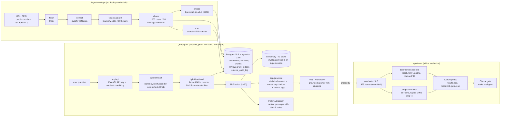

# DocScout system diagram

Status: **Production system architecture.** Implemented, verified, and active.

## Trust boundaries

| Boundary | Rule |
|---|---|
| Internet -> ingestion | All fetched text is **data, never instructions** (skill `corpus-injection-defense`). Delimited on entry to any prompt. |
| Ingestion -> deploy | Separate stages. Ingestion environment holds **no** deploy/cloud credentials. |
| Retrieved chunk -> generator | Wrapped in `<document>` delimiters; system prompt declares instructions inside them invalid. |
| API -> public | API-key gated and rate-limited from the first deploy. |
| MCP tool result -> agent | Untrusted input; servers pinned and audited (`docs/security/mcp-server-audit.md`). |
